### Git Industry Commands
1. Git Configuration Commands
        Used to set user identities
    ## i. Command Name : git config --global user.name
    **Syntax :** 
    git config --global user.name
    **Purpose :**
    This command is used to set the username for all your Git repositories on your system 
    **Example :**
     git config --global user.name Dhana

    ## ii. Command Name : git config --global user.email
    **Syntax :**
     git config -- global user.email
    **Purpose :**
     This command is used to set the email address used in commits and also 
    show your email
    **Example :**
     git config --global user.email "dhanalakshmi3kola@gmail.com"

    ## iii. Command Name : git config --list
    **Syntax :**
     git config --list
    **Purpose :**
     Displays all Git Configuration settings
    **Example :**
     git config --list

    ## iv.  Command Name : git config --unset
    **Syntax :**
     git config --global --unset user.email
    **Purpose :**
     Removes a configuration value
    **Example :**
     git config --global --unset user.name
    ** Screenshot **
    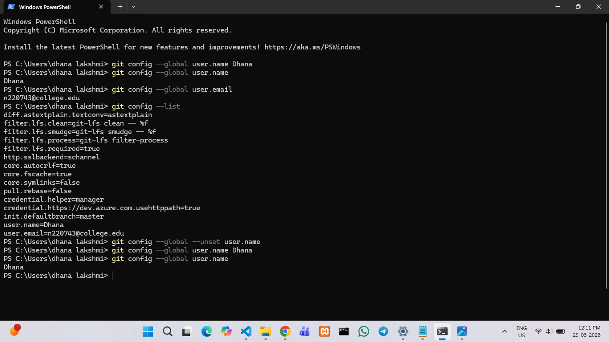
2. Repository Setup Commands
    Used to create or copy repositories

    ## i. Command Name : git init
    **Syntax :**
     git init
    **Purpose :**
     Initializes a new Git Repository
    **Example :**
    git init 

    ## ii. Command Name : git clone 
    **Syntax :**
     git clone <repository-url>
    **Purpose:**
    Copies a remote repository to your local system
    **Example :**
     git clone https://github.com/Dhana-220743/Git-commands

    ## iii. Command Name : git clone --branch
    **Syntax :**
     git clone --branch <branch-name> <url>
    **Purpose :**
     clones a specific branch
    **Example :**
     git clone --branch cloning https://github.com/Dhana-220743/my-first-repo

    ## iv. Command Name : git clone --depth
    **Syntax :**
     git clone --depth <number> <url>
    **Purpose :**
     Performs a shallow clone
    **Example :**
     git clone --depth 1  https://github.com/Dhana-220743/my-first-repo
    **Screenshot:**
    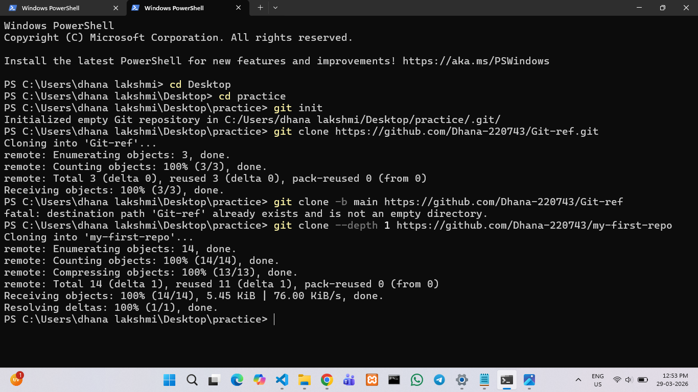

3. Repository Status and Inspection 
    Used to inspect history and changes

    ## i. Command Name : git status
    **Syntax :**
     git status
    **Purpose :**
     Show current file status
    **Example :**
     git status

    ## ii. Command Name : git log
    **Syntax :**
     git log
    **Purpose :**
     Displays commit history
    **Example :**
     git log

   ## iii. Command Name : git log --oneline
    **Syntax :**
     git log --oneline
    **Purpose :**
     Shows commit history in single line format
   **Example :** git log --oneline

    ## iv. Command Name : git log --graph --oneline
    **Syntax :**
     git log --graph --oneline
    **Purpose :**
     Displays branch structure visually
    **Example :**
      git log --graph --oneline

    ## v. Command Name : git show
    **Syntax :**
     git show <commit-id>
    **Purpose :**
     Shows details of commit 
    **Example :**
     git show 

    ## vi. Command Name : git diff
    **Syntax :**
     git diff
    **Purpose :**
     Displays unstaged changes
    **Example :**
     git diff

    ## vii. Command Name : git diff --staged
    **Syntax :**
     git diff --staged
    **Purpose :**
     Displays staged changes
    **Example :**
     git diff --staged

    ## viii. Command Name : git blame
    **Syntax :**
     git blame
    **Purpose :**
     Shows modified each line
    **Example :**
     git blame

    ## ix. Command Name : git reflog
    **Syntax :**
     git reflog
    **Purpose :**
     Tracks all head movements
    **Example :**
     git reflog

    ## x. Command Name : git shortlog
    **Syntax :**
     git shortlog
    **Purpose :**
     Summarizes commit 
    **Example :**
     git shortlog

     **Screenshots**
     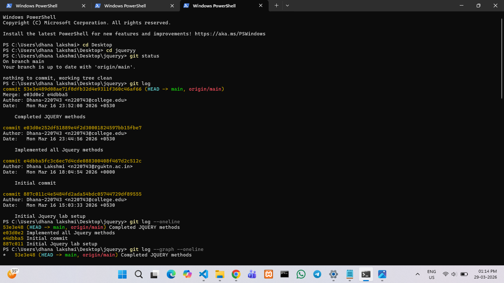
      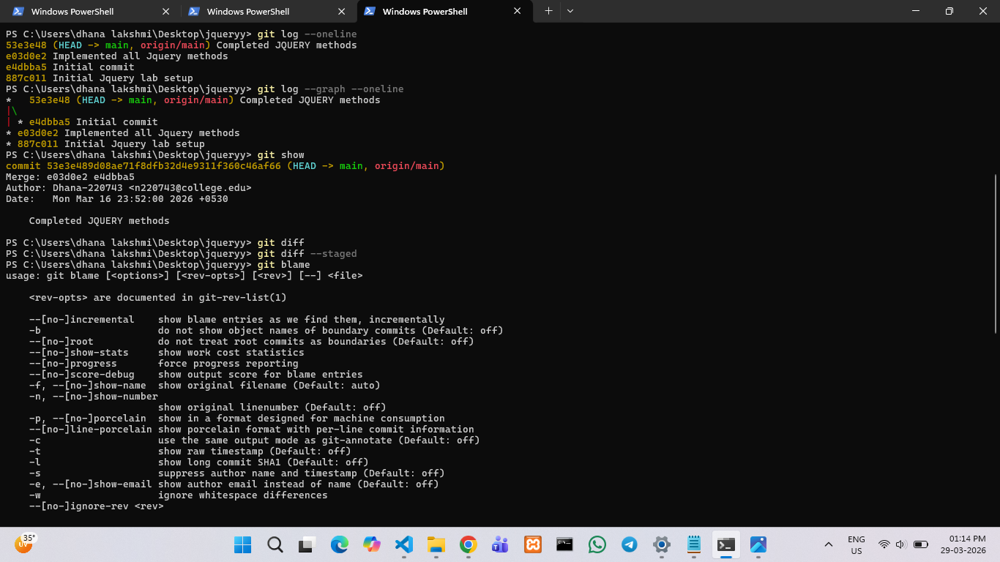
       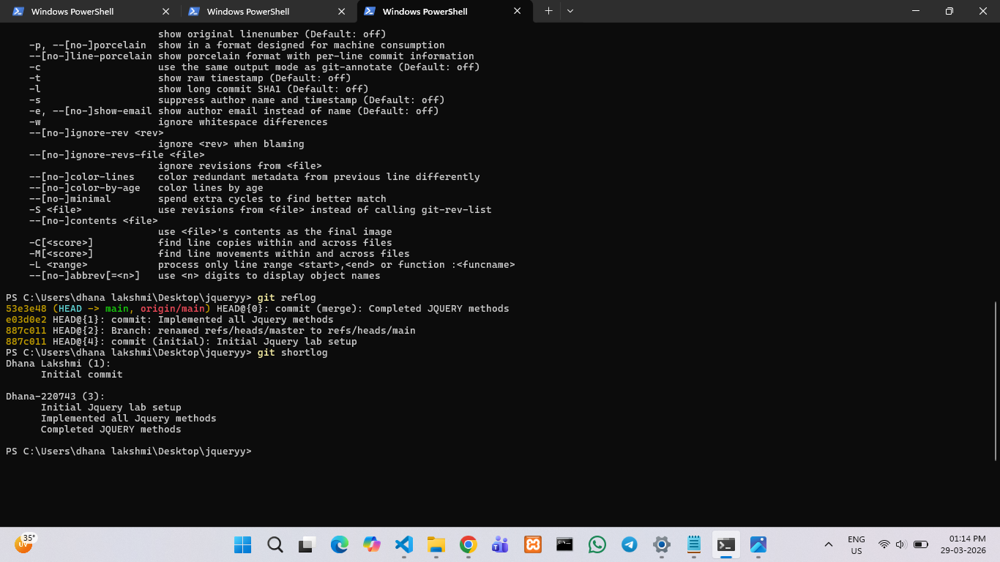

4. File Tracking Commands
    Used to manage files

    ## i. Command Name : git add
    **Syntax :**
     git add <file>
    **Purpose :**
     Stages a file
    **Example :**
     git add git_commands.txt

    ## ii. Command Name : git add .
    **Syntax :**
     git add .
    **Purpose :**
     Stages all files
    **Example :**
     git add .

    ## iii. Command Name : git add -p
    **Syntax :**
     git add -p
    **Purpose :**
     Stages changes interactively
    **Example :**
     git add -p

    ## iv. Command Name : git restore
    **Syntax :**
     git restore <file name>
    **Purpose :**
     Discards working directory changes
    **Example :**
     git restore git_commands.txt

    ## v. Command Name : git restore --staged
    **Syntax :**
     git restore --staged <file name>
    **Purpose :** 
    Unstages a file
    **Example :**
     git restore --staged git_commands.txt

    ## vi. Command Name : git rm
    **Syntax :**
     git rm <file name>
    **Purpose :**
     Delete a file and stages removal
    **Example :**
     git rm git_commands.txt

    ## vii. Command Name : git mv
    **Syntax :**
     git mv old new
    **Purpose :**
     Removes or moves a file
    **Example :**
     git mv git_file.txt git_commands.txt

    **Screenshot**
    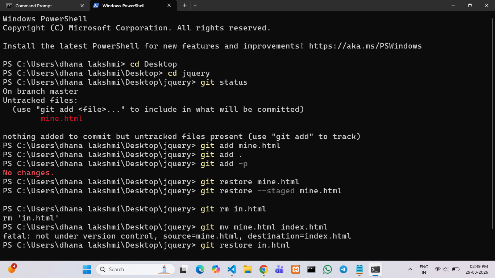

5. Commit commands
    Used to save changes

    ## i. Command Name : git commit
    **Syntax :**
     git commit
    **Purpose :**
     Creates a commit
    **Example :**
     git commit

    ## ii. Command Name : git commit -m
    **Syntax :**
     git commit -m <message name>
    **Purpose :**
     Creates a commit with message
    **Example :**
     git commit -m "file is added"

    ## iii. Command Name : git commit --amend
    **Syntax :**
     git commit --amend
    **Purpose :**
     Edits last commit
    **Example :**
     git command --amend

    ## iv. Command Name : git commit --no-edit
    **Syntax :**
     git commit --amend --no-edit
    **Purpose :**
     Add changes without changing message
    **Example :**
     git commit --amend --no-edit 

    **Screenshot**
    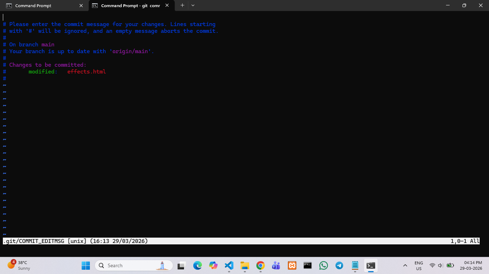

    **Screenshot**
    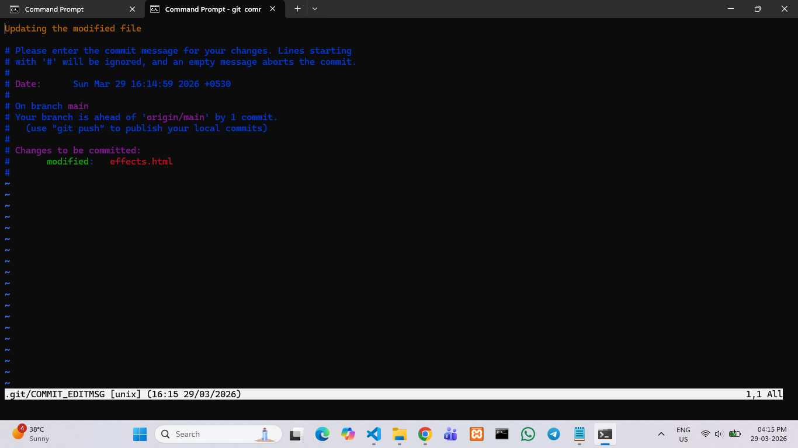

    **Screenshot**
    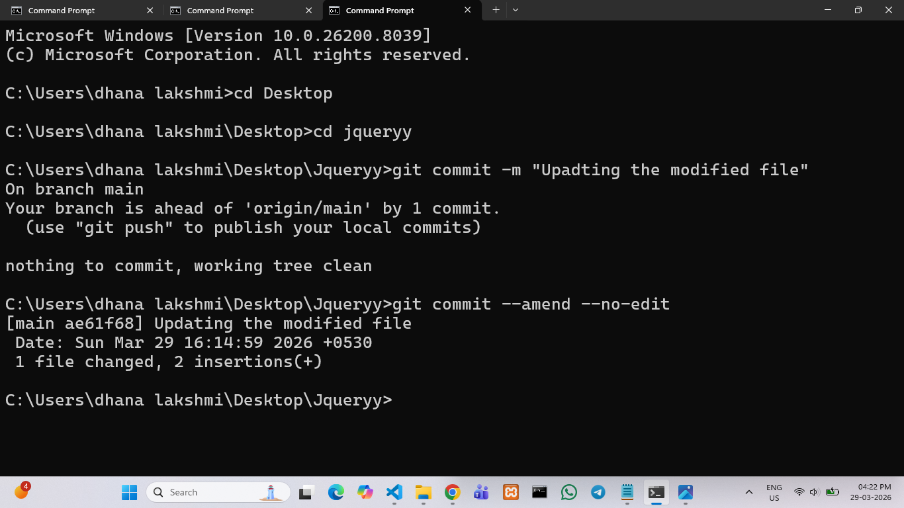

6. Branch Management
    Used for parallel development

    ## i. Command Name : git branch
    **Syntax :**
     git branch
    **Purpose :**
     List all branches in that repository
    **Example :**
     git branch

    ## ii. Command Name : git branch -a
    **Syntax :** 
    git branch -a
    **Purpose :**
     Lists local and remote branches
    **Example :**
     git branch -a

    ## iii. Command Name : git branch -d
    **Syntax :**
     git branch -d <branch name>
    **Purpose :**
     Deletes the branch with a warning
    **Example :**
     git branch -d cloning

    ## iv. Command Name : git branch -D
    **Syntax :**
     git branch -D <branch name>
    **Purpose :**
     Forcibly deletes the branch
    **Example :**
     git branch -D cloning

    ## v. Command Name : git checkout
    **Syntax :**
     git checkout <branch name>
    **Purpose :**
     switches branches
    **Example :**
     git checkout main

    ## vi. Command Name : git checkout -b
    **Syntax :**
     git checkout -b <branch name>
    **Purpose :**
     Creates and switches branch
    **Example :**
     git checkout -b feature-login

    ## vii. Command Name : git switch
    **Syntax :**
     git switch <branch name>
    **Purpose :**
     Switching into another branch
    **Example :**
     git switch main

    ## viii. Command Name : git switch -c
    **Syntax :**
     git switch -c <branch name>
    **Purpose :**
     Creates and switch branch
    **Example :**
     git switch -c feature-dashboard
     
     **Screenshot**
    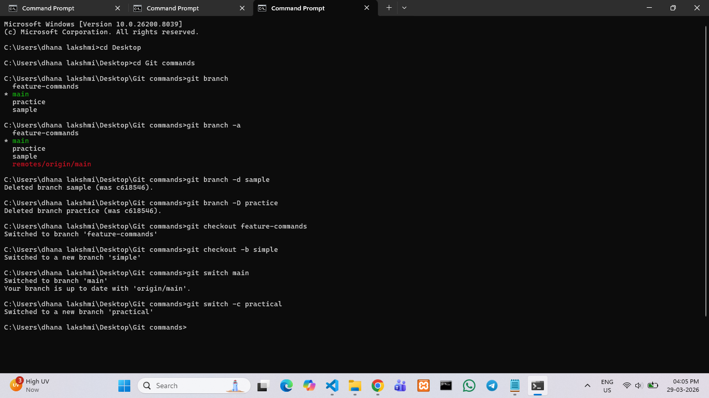

7. Merge and Integration

    ## i. Command Name : git merge
    **Syntax :**
     git merge
    **Purpose :**
     Merges branch
    **Example :**
     git merge

    ## ii. Command Name : git merge --no-ff
    **Syntax :**
     git merge --no-ff
    **Purpose :**
     Creates merge commit
    **Example :**
     git merge --no-ff
    **Screenshot**
     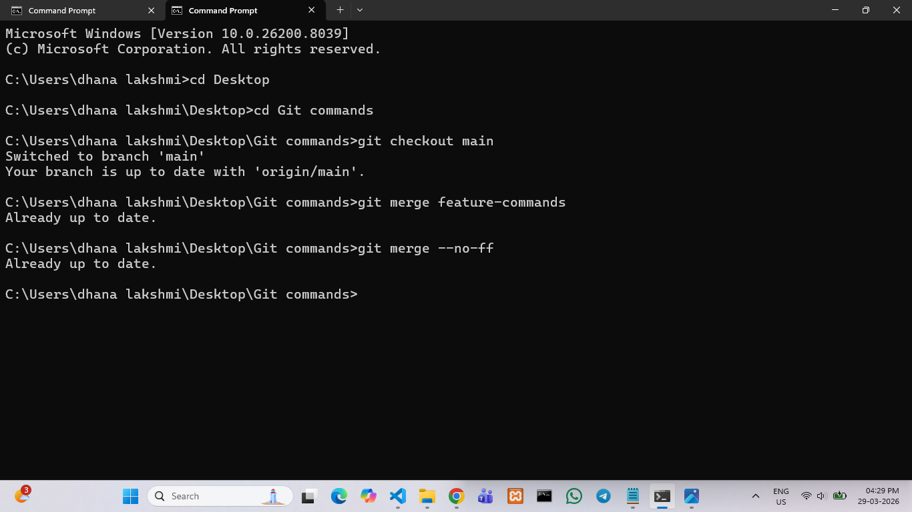

8. Remote Repository Commands
    Used to connect with Github

    ## i. Command Name : git remote
    **Syntax :**
     git remote
    **Purpose :**
     Lists remotes
    **Example :**
     git remote

    ## ii. Command Name : git remote -v
    **Syntax :**
     git remote -v
    **Purpose :**
     Displays all remote repositories (fetch & push URLs).
    **Example :**
     git remote -value

    ## iii. Command Name : git remote add
    **Syntax :**
     git remote add <name> <repo url>
    **Purpose :**
     Adds a new remote repository 
    **Example :**
     git remote add

    ## iv. Command Name : git fetch
    **Syntax :**
     git fetch
    **Purpose :**
     downloads changes from a remote repository without applying them to your code.
    **Example :**
     git fetch

    ## v. Command Name : git pull
    **Syntax :**
     git pull <remote> <branch>
    **Purpose :**
     It combines both Fetch and Merge
    **Example :**
     git pull origin main

    ## vi. Command Name : git push
    **Syntax :**
     git push
    **Purpose :**
     Uploads commits
    **Example :**
     git push

    ## vii. Command Name : git push -u origin branch-name
    **Syntax :**
     git push -u origin branch-name
    **Purpose :**
     Sets upstream
    **Example :**
     git push -u origin main

    ## viii. Command Name : git push --force
    **Syntax :**
     git push --force
    **Purpose :**
     Force push
    **Example :**
     git push --force

      **Screenshot**
    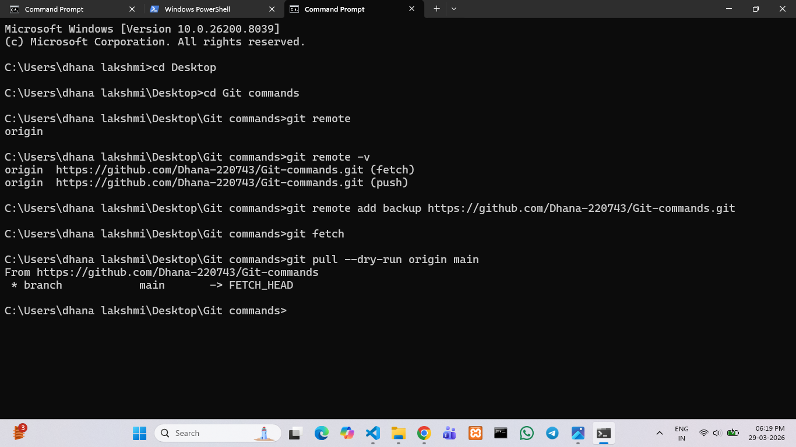

     **Screenshot**
    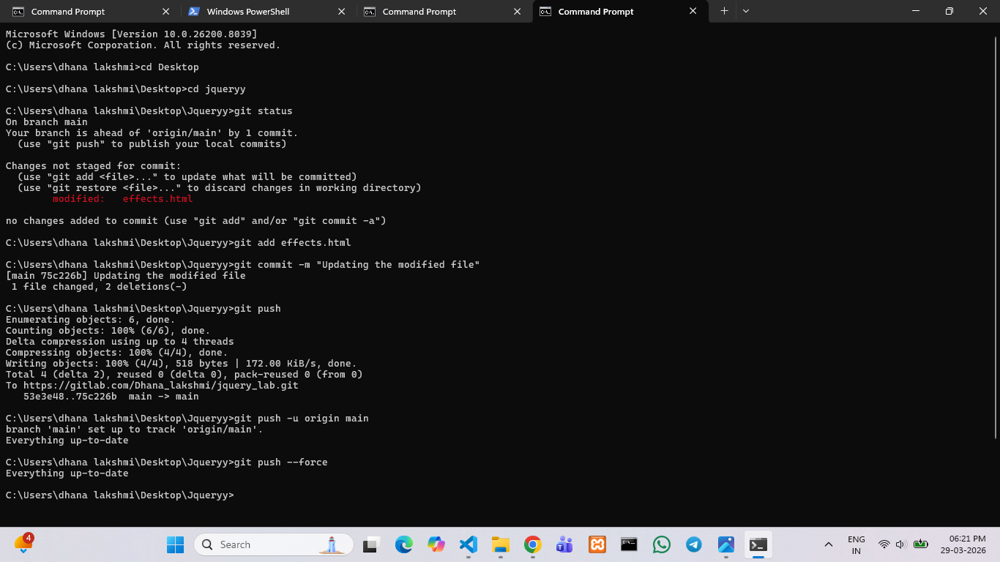

9. Stash Commands   
    Temporary save
    ## i. Command Name : git stash
    **Syntax :**
     git stash
    **Purpose :**
     Temporarily saves all uncommitted changes (both tracked and staged) and clears your working directory.
    **Example :**
     git stash

    ## ii. Command Name : git stash list
    **Syntax :**
     git stash list
    **Purpose :**
     Lists stashes
    **Example :**
     git stash list

    ## iii. Command Name : git stash pop
    **Syntax :**
     git stash pop
    **Purpose :**
     Applies the most recent stash and removes it from stash list.
    **Example :**
     git stash pop

    ## iv. Command Name : git stash apply
    **Syntax :**
     git stash apply
    **Purpose :**
    Applies stashed changes without removing them from stash.
    **Example :**
     git stash apply

    ## v. Command Name : git stash drop
    **Syntax :**
     git stash drop
    **Purpose :**
     Deletes a stash from the stash list. 
    **Example :**
     git stash drop

    ## vi. Command Name : git stash clear
    **Syntax :**
     git stash clear
    **Purpose :**
     Clears all stashes
    **Example :**
     git stash clear

     **Screenshot**
    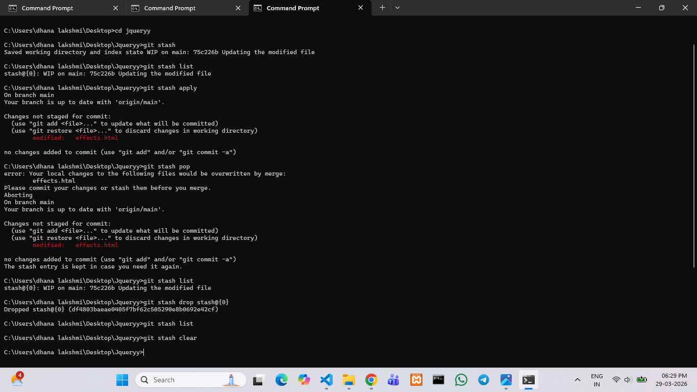

10. Reset and Undo

    ## i. Command Name : git reset
    **Syntax :**
     git reset <commit-hash>
    **Purpose :**
     Move HEAD to a specific commit, default is --mixed.
    **Example :**
     git reset abc123

    ## ii. Command Name : git reset --soft
    **Syntax :**
     git reset
    **Purpose :**
     Moves HEAD but keep all changes staged.
    **Example :**
     git reset --soft abc123

     ### iii. Command name : git reset --mixed
     **Syntax :**
     git reset --mixed <commit>
    **Purpose :**
     Undo a commit and unstage changes (keep them in working directory).
    **Example :**
     git reset --mixed abc123

     ### iv. Command name : git reset --hard
     **Syntax :**
     git reset --hard <commit>
    **Purpose :**
     Undo commit(s) and delete all changes in staging area and working directory.
    **Example :**
     git reset --hard abc123

     ### v. Command name : git revert
     **Syntax :**
     git revert <commit>
    **Purpose :**
     Undo a commit by creating a new commit that reverses the changes.
    Safe for shared repositories because it doesn’t rewrite history.
    **Example :**
     git revert HEAD

     ### vi. Command name : git clean -f
     **Syntax :**
     git clean -f
    **Purpose :**
     Remove untracked files from working directory.
    **Example :**
     git clean -f

     ### vii. Command name : git clean -fd
     **Syntax :**
     git clean -fd
    **Purpose :**
     Remove untracked files and directories.
    **Example :**
     git clean -fd

